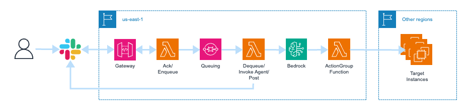

cdk-bedrock
===========

Create a Slackbot API in CDK that makes requests to Agents for Amazon Bedrock.



Prerequisites
-------------

First, Create `parameter.ts` to set your parameters as follows:

```ts
import { Parameter } from "./parameter.template";

export const parameter: Parameter = {
  env: {
    account: process.env.CDK_DEFAULT_ACCOUNT,
    region: "us-east-1",
  },
  terminationProtection: false,
  owner: "stack-creator",
  serviceName: "test-service",
  allowedIps: ["0.0.0.0/0"],
  httpProxy: "http://your-proxy.com:port",
  hostZoneName: "your-domain.com",
  repository: "user/your-app",
  slackOAuthToken: "foo",
  slackSigningSecret: "bar",
  hasUI: false,
};
```

Usage
-----

Deploy resources with the following command:

```sh
cdk synth
cdk deploy
```
